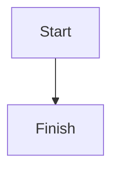

# blog

Personal blog built with [Astro](https://astro.build), deployed at https://truman.mulholland.nz.

## Comments

To comment on a post, submit a pull request here adding a Markdown file to:

`src/content/comments/{post-name}/`

### Using the VS Code task (recommended)

1. Open the Command Palette (`Ctrl+Shift+P` / `Cmd+Shift+P`)
2. Run **Tasks: Run Task** → **New Comment**
3. Enter the post slug (e.g. `my-post-title`) and your name when prompted
4. The file is created at the correct path with frontmatter pre-filled

### Manually

File name: `{unix-timestamp}-{your-name}.md`

```markdown
---
author: Your Name
date: 2026-03-07T10:00:00Z
# url: https://your-website.com  # optional, delete this line if not applicable
---

Your comment here. You can use **markdown**!
```

## Mermaid diagrams

Use Mermaid diagrams in blog posts with a `mermaid` fence. The diagram renders in the browser and follows the site's light/dark theme toggle.

````markdown

````

To show the source instead, add `source` after the language. It remains a syntax-highlighted code block:

````markdown

````

## Contributions

This is my personal blog, but I am happy to accept contributions such as:

- Comments (as above)
- Corrections (typos, etc)
